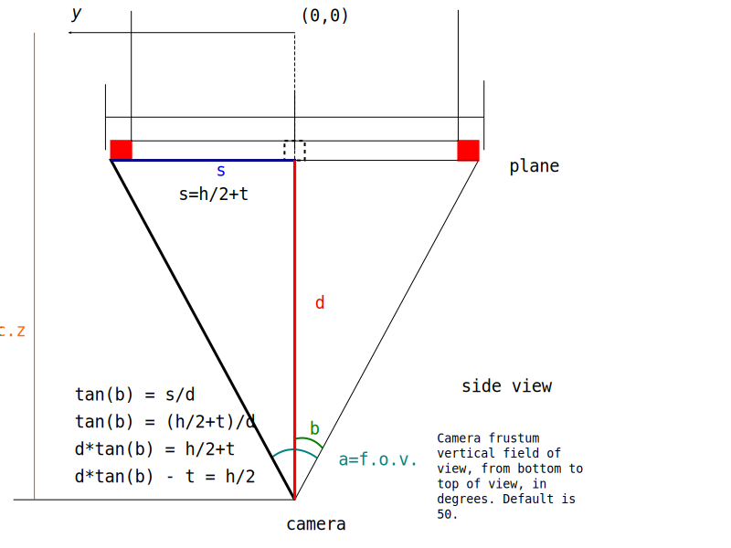

# hydra 
as "sky" and "floor" of escher's _another world 2_

# three.js and escher

three.js model of escher's _another world 2_

## TODO

- add code(mirror) editors for each surface

## Instructions-ish

- keyboard "q" will reset the view
- twice keyboard "h" will show UI
- drag mouse gesture (hopefully you'll be/get surprised)
- refresh on window resize

## Poor explanation of perspective computations

just for personal explanation: sorry about that :{()

## some renders using three.js' SVGRenderer

